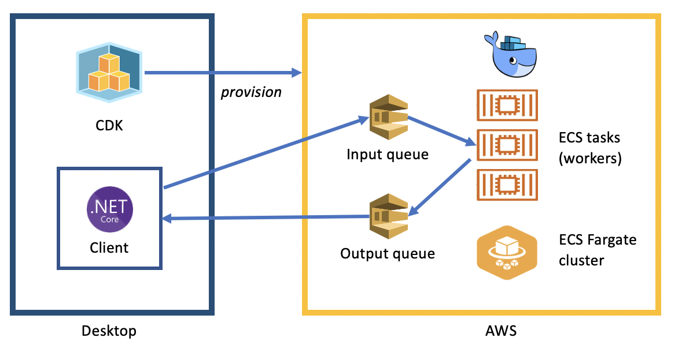

# Desktop HPC

This repository provides a sample implemnenation of desktop high performance Computing (HPC).  The use case is trivial, the goal is to find factors for a series of large (one trillion or larger) numbers.

